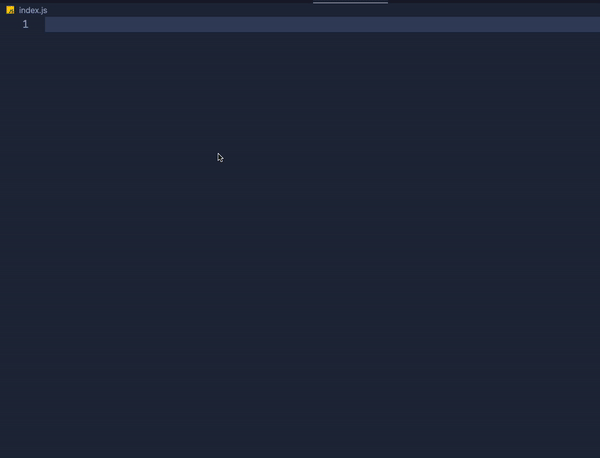

# Elix Web Components Snippets

[Elix](https://component.kitchen/elix) is an open collection of high-quality web components for common user interface patterns. This snippet extension for vscode is used to generate JavaScript snippets using Elix APIs.

## Setup

Just install this package from the [Extension Marketplace](https://marketplace.visualstudio.com/VSCode), then make sure to add `"editor.snippetSuggestions": "top"` to your user settings to see these snippets on top in the suggestion popover.

## Snippets

Snippets are optimized to be short and easy to remember.

Below is a list of all available snippets and the triggers of each one. Press `Ctrl + Space` and start with elix to see the list of snippets

| Snippet Name   | Description                                                      |
| ----------- | ------------------------------------------------------------------- |
| `elix-class`     | Create JavaScript class extending Elix's ReactiveElement       |
| `elix-getter`     | Getter for selected string with Elix state API       |
| `elix-setter`     | Setter for selected string with Elix state API       |
| `elix-getter-setter`     | Getter and Setter for selected string with Elix state API       |

## Reference & Sources
- [Github Elix](https://github.com/elix/elix)